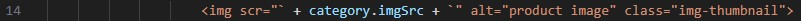
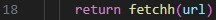
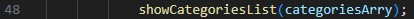
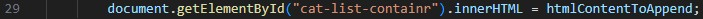
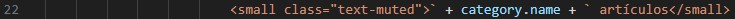
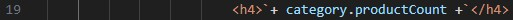

<h1> Grupo 1 - Anthony Martinelli, Leandro Ortiz, Kimberly Perez, Aparicio Oromi, Daphne Martiarena y Cristal Beltran. </h1>
<p> Errores localizados: </p>

```html

En línea de código 14 de listado.js, tiene un error tipográfico "scr" en vez de "src":

```


```html

En línea 18 de init.js "fetchh" es un error tipográfico, debería ser "fetch":

```


```html

En línea 20 de listado.js: "<p> `+ category.descripion +`</p>", debería ser "<p> `+ category.description +`</p>":

```


```html

En línea 48 de listado.js, "showCategoriesList(categoriesArry);" debería ser "showCategoriesList(categoriesArray);":

```


```html

En línea 29 de listado.js, "document.getElementById("cat-list-containr").innerHTML = htmlContentToAppend;" debería ser "document.getElementById("cat-list-container").innerHTML = htmlContentToAppend;":

```


```html

En línea 22 de listado.js, "<small class="text-muted">` + category.name + ` artículos</small>" debería ser "<small class="text-muted">` + category.productCount + ` artículos</small>":

```


```html

En línea 19 de listado.js, "<h4>`+ category.productCount +`</h4>" debería ser "<h4>`+ category.name +`</h4>":

```



<h1> 2) </h1>

<p> Nuestro resultado de la investigación: </p>

```html
Una API permite que dos aplicaciones se comuniquen. En el caso de las APIs web, esta comunicación se hace a través de HTTP, el mismo protocolo que usamos al navegar por internet. Para enviar y recibir información, generalmente se utiliza el formato JSON, que es liviano, fácil de leer y de interpretar por las aplicaciones.

Ejemplos:

    API: la de Google Maps, que otras apps usan para mostrar mapas o calcular rutas.
    HTTP: cuando una app hace una solicitud como "https://api.clima.com/datos?ciudad=Montevideo" para pedir el clima.
    JSON: la respuesta a esa solicitud podría ser algo como: "{"ciudad": "Montevideo", "temperatura": 22º, "clima": "soleado"}".
```